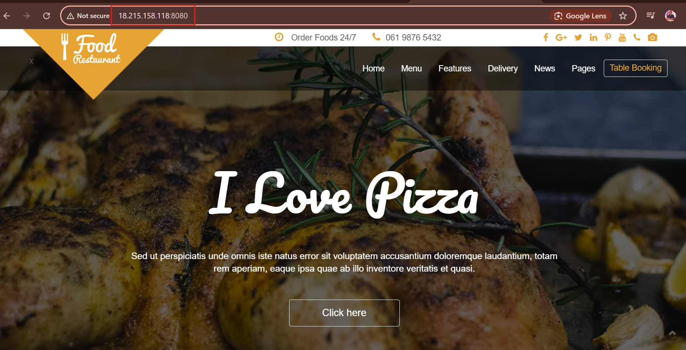

k8s_first task 1/20

LAB
    #Create a Ubuntu VM

   create  EC2 Instance 
   connect through ssh-i 

   than 
    
#Install Docker on VM
#Start and enable Docker 

  sudo apt -y install docker
  sudo apt install docker.io

#Start and enable docker
  sudo systemctl start docker
  sudo systemctl enable docker

#Once enabled, provide permissions for docker-sock
  sudo chmod 666 /var/run/docker.sock

Than

    git clone <https://github.com/Ai-TechNov/Food-App.git>

    cd <https://github.com/Ai-TechNov/Food-App.git>

# create Docker File :

     vi Dockerfile

          # Use Nginx as the base image
          FROM nginx:alpine

          # Remove default nginx static files
           RUN rm -rf /usr/share/nginx/html/*

          # Copy app files to nginx public folder
          COPY . /usr/share/nginx/html

         # Expose port 80
           EXPOSE 80

        # Start Nginx (default command already runs nginx)

    Save it :wq!

    and Than run above file as image :

            docker build -t food-app .

# check docker image created or not .

            docker images

# run the Container :

          docker run -d -p 8080:80 --name food-app-container food-app
  
# Than Finally Access the App from browser :

          http://localhost:8080 (or your EC2 public IP if running there)      

