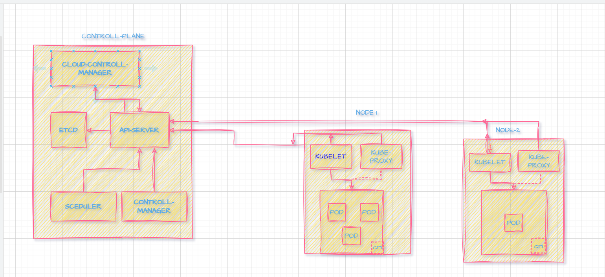
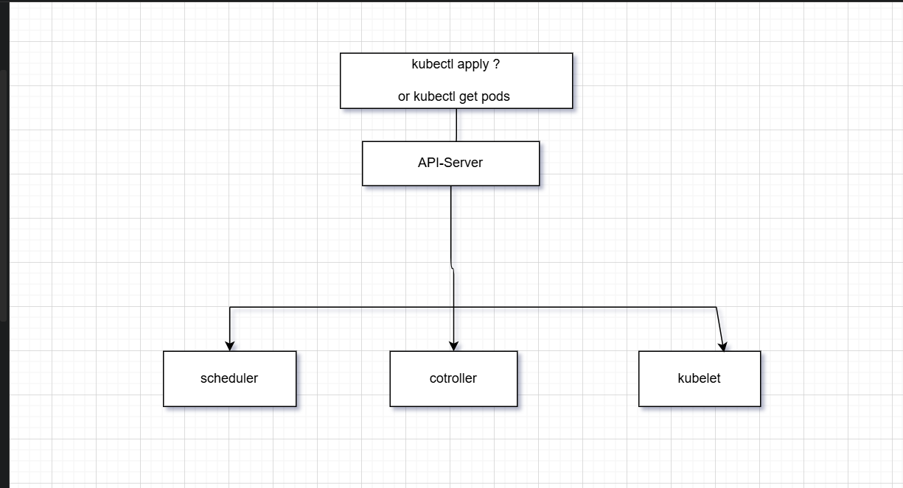

## Deep Dive into Kubernetes Architecture and Command Flow**

### 🎯 **Objective:**

Gain a strong understanding of Kubernetes internals, visualize its architecture, and share your insights with the community.

### 🧠 Kubernetes Architecture & Workflow – Key Learnin

### 🏗️ 1. Core Components of Kubernetes

### ✅ Master Node (Control Plane):

   Responsible for managing the Kubernetes cluster.

**API Server**: Central hub for all requests (kubectl, UI, etc.)

**Controller Manage**r: Ensures the desired state (e.g., 3 replicas) is maintained.

**Scheduler**: Assigns Pods to appropriate nodes based on resource availability.

**etcd**: Key-value store for cluster state (configuration and metadata).

### ✅ Worker Nodes (Minions)
Run the actual applications.

**kubelet**: Agent on each node that communicates with the API server.

**kube-proxy**: Manages networking and forwarding traffic.

**Container Runtime**: (e.g., containerd, Docker) Executes containerized apps.

🔁 2. Kubernetes Workflow

📥 Step-by-Step Flow of Deployment

        kubectl apply -f deployment.yaml

        API Server receives and validates the request.

        etcd stores the desired state.

        Scheduler assigns Pod to a Node.

        kubelet on the Node starts the container using the container runtime.

        kube-proxy sets up networking rules for service access.

### 📦 3. Kubernetes Objects

 **Pod:** Smallest deployable unit (1 or more containers).

**Deployment**:
Manages ReplicaSets and provides update/rollback features.

**Service**: 
Exposes Pods using stable IP or DNS.

**ConfigMap / Secret**: 
Externalize configuration and sensitive data.

**Namespace:** 
Logical partitioning in a cluster.

### 🌐 4. Networking in Kubernetes

    Every Pod gets its own IP.

    Services act as stable access points for Pods.

    ClusterIP, NodePort, LoadBalancer are Service types.

    Ingress routes external HTTP(S) traffic to internal services.

### 🔄 5. Self-Healing and Scaling

    Kubernetes ensures Pods are restarted if they fail.

    Horizontal Pod Autoscaler (HPA) scales based on CPU/memory.

    Replication ensures high availability.

### 🛡️ 6. Security and RBAC
    Role-Based Access Control (RBAC) defines who can access what.

    Secrets store passwords and tokens securely.

    Network Policies restrict pod-to-pod communication.

### ⚙️ 7. CI/CD & DevOps Integration
    Kubernetes integrates with Jenkins, Argo CD, GitLab CI, etc.

    Supports declarative deployments and GitOps workflows.

    Enables rolling updates, canary releases, and automated testing.

### 3. 🗺️ **Create Visual Diagrams**

#### a) 📊 **Kubernetes Architecture Diagram**

API server, etcd, Scheduler, Controllers, Kubelet, kube-proxy, Pods, Nodes.

#### b) ⚙️ **Kubectl Command Flow**

* Create a flow diagram that shows:

### 🧠 1. kubectl apply — Used to create or update resources
### ✅ Step-by-step Flow:

**1. kubectl apply Command Issued**

    You run: kubectl apply -f deployment.yaml

    This sends a REST API request to the Kubernetes API Server.

**2.API Server Receives the Request**

    Validates the YAML file syntax and authentication/authorization.

    Stores the desired state in etcd (the key-value store).

    Triggers the Controller Manager.

**3.Controller Manager**

    Watches etcd for changes in the cluster state.

    Detects that a new Deployment or Pod needs to be created.

    Creates a ReplicaSet, and requests Pod creation if needed.

**4.Scheduler**

    Watches for unscheduled Pods.

    Selects the best Worker Node for the Pod based on available resources and constraints.

    Binds the Pod to the chosen Node.

**5.Kubelet on the Worker Node**

    Watches for newly assigned Pods on its node via the API server.

    Pulls the container image.

    Starts the container using the container runtime (like containerd or Docker).

    Reports Pod status back to the API server.

### 🔍 2. kubectl get pods — ***Used to query resource information***
### ✅ Step-by-step Flow:

**1.kubectl get pods Command Issued**

    Sends a GET request to the API server.

**2.API Server Processes the Request**

    Fetches the current state of Pods from etcd or from its internal cache.

    Formats the result and sends the response back to kubectl.

**3.Scheduler, Controller, and Kubelet**

    Not involved directly in this read-only operation.

    They are only involved in maintaining and updating the cluster state.

**Pod vs Container - Simple Write-Up**

* Write a short paragraph explaining:

  * What a **Pod** is and why it exists.?
  * How it's different from a **Container**.?
* Use a relatable analogy if possible.?

*A **Pod** in Kubernetes is the smallest deployable unit and can contain one or more **containers** that share the same network and storage. Think of a **Pod** like a **shared apartment**, where multiple people (containers) live together — they each do different tasks, but they share the same kitchen (network) and storage space (volumes). In contrast, a **container** is like a **single person** living independently with their own space in Docker. Kubernetes uses Pods to group tightly coupled containers that need to work together, making it easier to manage, scale, and coordinate them as a unit rather than individually.*

