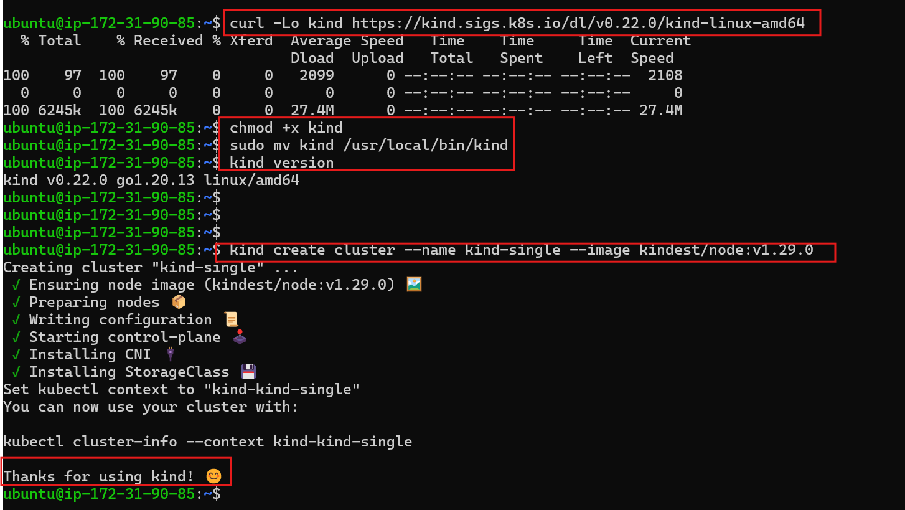
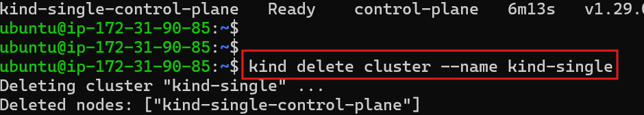

### ⚙️ **Part 2: Install KIND and Run Clusters**

### Install Kind On Ubuntu 

**To install Kind (Kubernetes IN Docker) on Ubuntu, follow these clean and reliable steps:**

**✅ Prerequisites**

**Docker must be installed and running**

To install Docker on Ubuntu:

    sudo apt update
    sudo apt install -y docker.io
    sudo systemctl enable docker
    sudo systemctl start docker

Add your user to the Docker group (optional, to avoid using sudo):

    sudo usermod -aG docker $USER

ℹ️ Note: You must log out and log back in (or reboot) after this to apply the group change.

**🔧 Install Kind on Ubuntu**

📥 Step 1: Download the Kind binary

    curl -Lo kind https://kind.sigs.k8s.io/dl/v0.22.0/kind-linux-amd64

🔐 Step 2: 

    Make it executable
    chmod +x kind

🚚 Step 3: 

    Move it to your PATH
    sudo mv kind /usr/local/bin/kind

✅ Verify the installation

    Run:
    kind version

    Expected output:
    kind v0.22.0

### 🚀 Create your first cluster

**kind create cluster** :

**a Single-Node KIND Cluster**

Run this command to create a cluster:

    kind create cluster --name kind-single --image kindest/node:v1.29.0

This will:

    Pull the required Docker image

    Create a single-node Kubernetes cluster named kind-sinle

### Verify the Cluster

Use kubectl to verify the cluster is working:

    kubectl cluster-info --context kind-kind-single
    kubectl get nodes

*If everything worked, you'll see the cluster information and one running node.* 

### Delete the Cluster (if needed)
To remove the cluster:

    kind delete cluster --name kind-single
    

