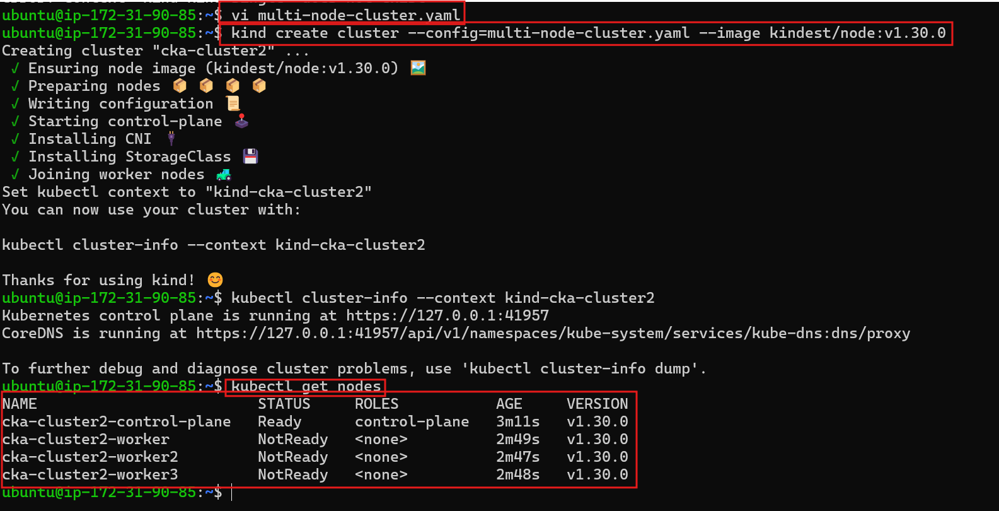
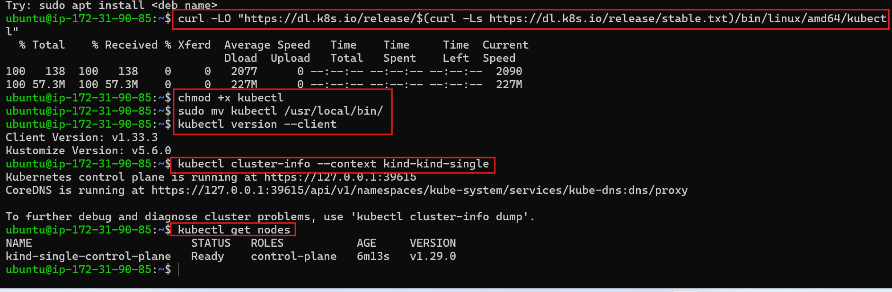

 ### Create a Multi-Node KIND Cluster

* Cluster Name: `cka-cluster2`

#### 🔁 Step 3: **Create a Multi-Node KIND Cluster**

* Cluster Name: `cka-cluster2`
* Nodes:

  * 1 control plane
  * 3 worker nodes
* Kubernetes Version: `v1.30.0`

📄 Create a config file `multi-node-cluster.yaml`:

```yaml
kind: Cluster
apiVersion: kind.x-k8s.io/v1alpha4
name: cka-cluster2
nodes:
  - role: control-plane
  - role: worker
  - role: worker
  - role: worker
```

🧱 Create the cluster:

```bash
kind create cluster --config=multi-node-cluster.yaml --image kindest/node:v1.30.0
```




### 🖥️ **Part 3: Install & Configure kubectl**

🔹 Step 1: Download the latest kubectl binary

    curl -LO "https://dl.k8s.io/release/$(curl -Ls https://dl.k8s.io/release/stable.txt)/bin/linux/amd64/kubectl"

🔹 Step 2:  Make it executable

    chmod +x kubectl

🔹 Step 3: Move it to a system path

    sudo mv kubectl /usr/local/bin/

🔹 Step 4: Verify the installation

    kubectl version --client

    Expected output:
    Client Version: v1.xx.x




