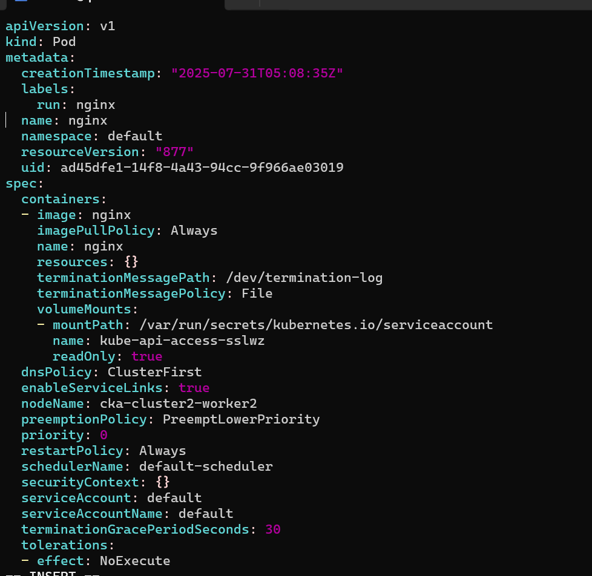
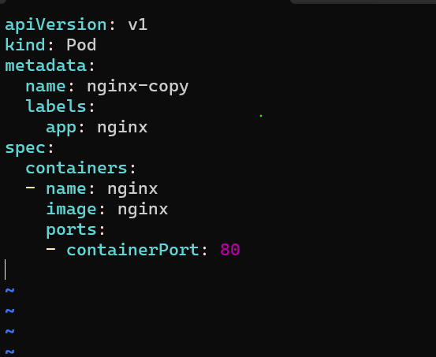
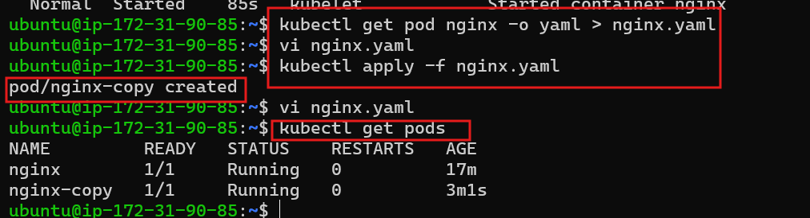
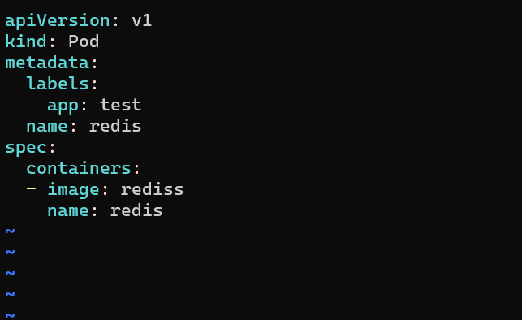
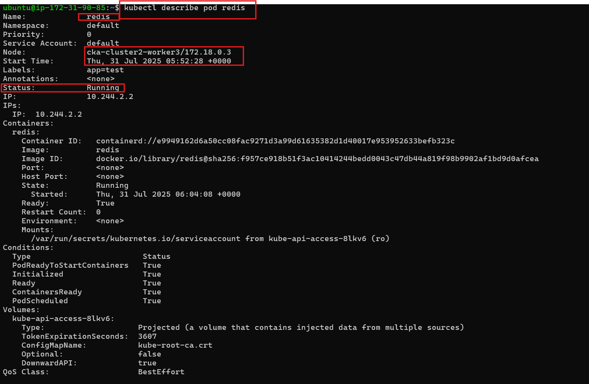
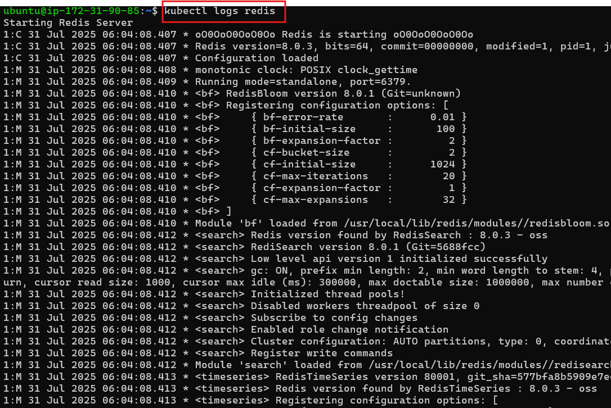

## 🚀 Kubernetes Hands-On Tasks (Pods & YAMLs)


### **Task 1: Create a Pod Imperatively**:

**Create a pod named `nginx` using the `nginx` image:**

 Using `kubectl` command:

        kubectl run nginx --image=nginx

✅ Verify it:

```bash
kubectl get pods
kubectl describe pod nginx
```


### ✅ **Task 2: Generate YAML and Reuse**

**✅ Step 1:** Export the Pod YAML:

*To generate the YAML of an existing Pod (e.g., the nginx Pod you created), use the following command:*

    kubectl get pod nginx -o yaml > nginx-exported.yaml

**This will:**

Fetch the full configuration of the `nginx Pod`

Output it in YAML format

Save it to a file called `nginx-exported.yaml`

**Reuse the YAML to Create Another Pod**:

*To reuse this YAML and create another Pod, follow these steps:*

1. Edit the YAML file and change the metadata name (Pod name must be unique):
    
    Example: Open in a text editor and update:
    
        metadata:
          name: nginx-copy
      
Apply the updated YAML:

        kubectl apply -f nginx-exported.yaml

#### Step 2: Edit the file:

*Here’s how your cleaned and reusable YAML file should look after editing*

📄 `nginx-new.yaml`

```yaml 
apiVersion: v1
kind: Pod
metadata:
  name: nginx-new
spec:
  containers:
  - name: nginx
    image: nginx
```




**✅ Key Changes Made:**


`metadata.name`: Changed from `nginx` to `nginx-new`

Removed all auto-generated fields:

    # status
    # uid
    # creationTimestamp
    # resourceVersion
    # selfLink
    # managedFields

 **Step 3**: Apply the YAML to create the new pod:

     kubectl apply -f nginx-new.yaml
✅ Verify:

```bash
kubectl get pods
kubectl describe pod nginx-new
```

### ✅ **Task 3: Apply and Fix This Broken YAML**
#### Given YAML:

```yaml
apiVersion: v1
kind: Pod
metadata:
  labels:
    app: test
  name: redis
spec:
  containers:
  - image: rediss
    name: redis
```
 **Step 1: Try to apply:**
 ```bash
kubectl apply -f redis.yaml
```

#### ❌ Expected Error:

```plaintext
Failed to pull image "rediss": rpc error: ...
```

### Here's how to ✅ fix and apply the broken YAML.

❌ **Problem in the Given YAML:**

1.**Image name is incorrect** – likely a typo (rediss should be redis).

Edit the file:


  ```bash
     vi redis.yaml
```
changes:
```yaml
     image: rediss
```
 To:
  ```yaml
     image: redis
```


2.**YAML is incomplete** – it's missing the closing elements (spec, containers, etc.).

3.**Indentation and structure** are technically fine but incomplete.

**✅ Fixed YAML:**
 
 ``` yaml
apiVersion: v1
kind: Pod
metadata:
  name: redis
  labels:
    app: test
spec:
  containers:
  - name: redis
    image: redis  
```    
2.**Reapply:**   

Save it as `redis-pod.yaml`, then run:
```yaml
kubectl apply -f redis-pod.yaml
```

✅ Verify:

```bash
kubectl get pods
kubectl describe pod redis
kubectl logs redis
```



### 📘 What to Document (Learning & Troubleshooting)

#**1. Imperative vs Declarative Approaches**

  Imperative
  
Directly run commands to create/manage resources	`kubectl run nginx --image=nginx`

Declarative

Define desired state in YAML/JSON files and apply	`kubectl apply -f pod.yaml`

#**📌2. YAML structure: `metadata`, `spec`, `containers`**

 . YAML Structure Essentials

✅ `apiVersion`

Specifies which Kubernetes API version to use (e.g., v1 for Pod).

✅` kind`

Defines the type of object (e.g., `Pod`, `Deployment`).

✅ `metadata`

Identifies the object with:

 `name`: unique resource name.

 `labels`: key-value pairs for grouping/selecting.

✅ `spec`

The desired behavior and configuration:

    containers: array of container specs:

        name: container name

        image: image to use

        (Optional) ports, env, volumeMounts, etc.

📌 **3. Common Issues & Fixes**   

    Wrong image name

    missing fields 

    invalid indentation

    name conflict

    unwanted auto-generated fields
    
    pod stuck in 
        `imagePullBackOff`