 ## Mastering Deployments, ReplicaSets & Rollouts in Kubernetes**

### 🎯 **Objective:**

Learn how to manage Kubernetes **ReplicaSets and Deployments**, update Pod templates, view rollout history, and troubleshoot YAML issues.

**PART 1: Working with ReplicaSets**:

 ### **Task 1: Create a ReplicaSet with 3 replicas of NGINX*

 **What is a ReplicaSet in Kubernetes?**

A ReplicaSet ensures that a specified number of identical pod replicas are running at all times.

**Key Purpose**:

To maintain pod availability — if a pod crashes or is deleted, the ReplicaSet will automatically create a new one.

```bash
kubectl create rs nginx-rs --image=nginx --replicas=3
```
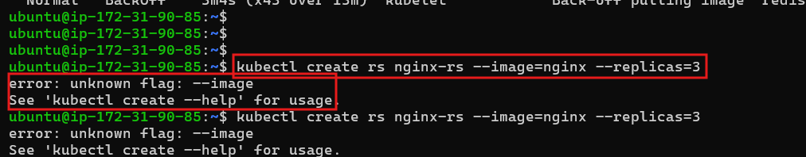

*You're getting this error because `ReplicaSet (rs)` does not support the `--image` flag with `kubectl create`.*

*The `--image` flag only works with `kubectl create deployment`, not with `replicaset`.*

 **Use `kubectl create deployment` Instead**
```bash
 kubectl create deployment nginx-deployment --image=nginx --replicas=3
 ```
 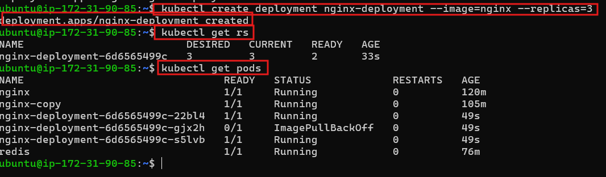

  **Task 2: Update the ReplicaSet YAML to 4 replicas**:

 1. Export and edit:

```bash
kubectl get rs nginx-rs -o yaml > nginx-rs.yaml
```

2. Update:

```yaml
spec:
  replicas: 4
```

3. Apply:

```bash
kubectl apply -f nginx-rs.yaml
```

✅ Verify:

```bash
kubectl get rs
```
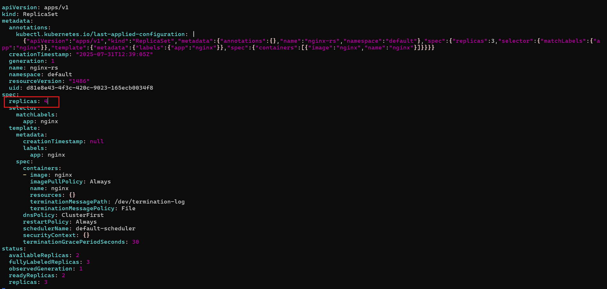
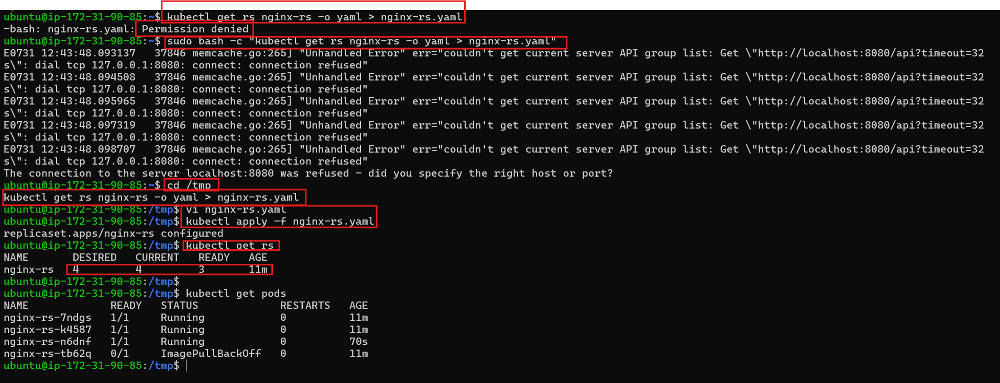 

### 🔹 Task 3: Scale to 6 replicas via command line:


 


```bash
kubectl scale rs nginx-rs --replicas=6
```

✅ Check:

```bash
kubectl get rs
kubectl get pods
```
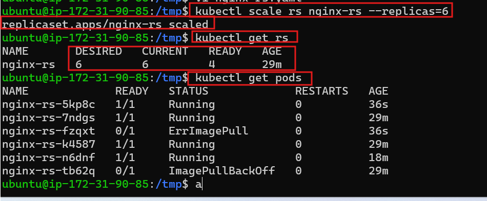

## 📦 **PART 2: Managing a Deployment**

### 🔹 Task 1: Create a Deployment
🔹 Step 1: Generate the Deployment YAML

Run this command to create a deployment manifest:
```bash
kubectl create deployment nginx \
  --image=nginx:1.23.0 \
  --replicas=3 \
  --dry-run=client -o yaml > nginx-deploy.y
```
 This will create a file nginx-deploy.yaml in your current directory.

 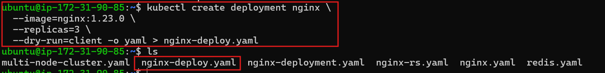

  Step 2: Edit the File to Update Labels

  Open the file:
 ```bash
    vi nginx-deploy.yaml
```
! [preview] (images/nginx_deploy_open.png)

Replace the content with this (or just modify the existing fields):
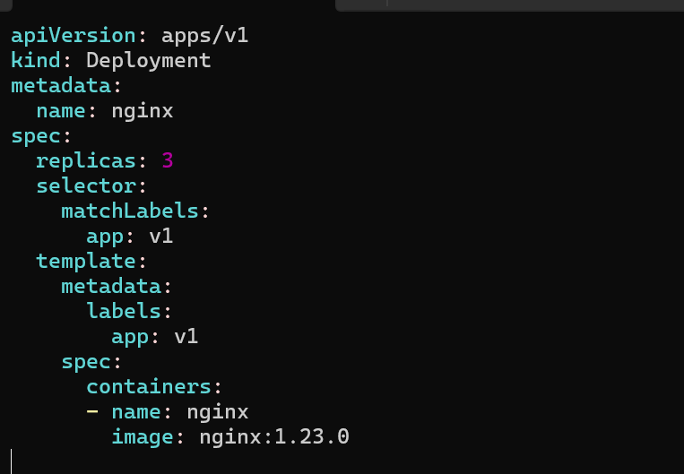
**Save and exit**
 
 Step 3: Apply the Deployment
```bash
kubectl apply -f nginx-deploy.yaml
```
🔹 Step 4: Add a Label to the Deployment
```bash
kubectl label deployment nginx tier=backend
```
🔹 Step 5: Verify
```bash
kubectl get deployments
kubectl get pods --show-labels
```
*You should see:*

  1. Deployment named nginx

  2. 3 pods running

  3. Labels like app=v1 and tier=backend


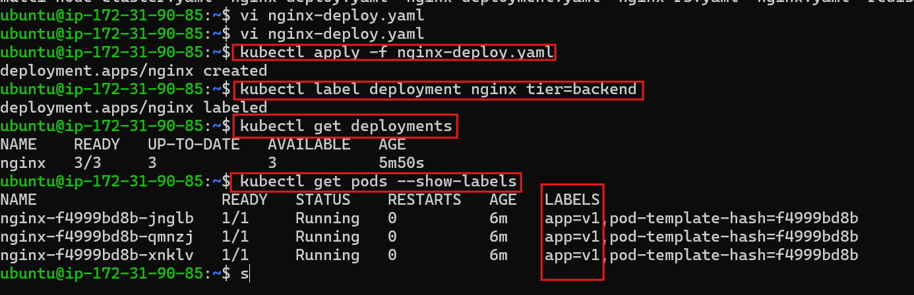

### ✅ Task 2: Update the Image to nginx:1.23.4
🔹 Step 6: Update the container image to a new version

```bash
kubectl set image deployment/nginx nginx=nginx:1.23.4
```
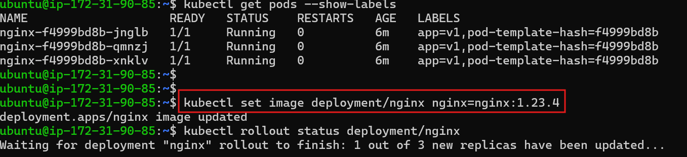

✅ Verify:

```bash
kubectl rollout status deployment/nginx
kubectl describe deployment nginx | grep Image
```
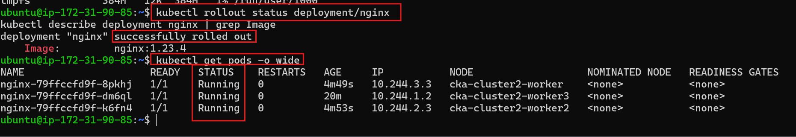

### 🔹 Task 3: Annotate the reason for change

 *add an annotation to the Deployment to describe the reason for the change. This is useful for auditing and understanding why a deployment update happened.*

  Step-by-step for Task 3: Annotate the Deployment

  Run the following command:
```bash
kubectl annotate deployment nginx kubernetes.io/change-cause="Pick up patch version"
```
This will add metadata to your Deployment like this:
```yaml
annotations:
  kubernetes.io/change-cause: Pick up patch version
```  
 Verify the Annotation:
```
 You can confirm it using:
 kubectl describe deployment nginx | grep -i "change-cause"
```
You should see:
```bash
Annotations:  kubernetes.io/change-cause: Pick up patch version
```
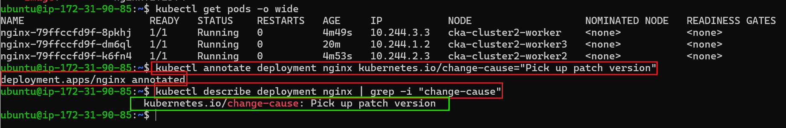


### 🔹 Task 4: Scale to 5 replicas:

🔹 1. Scale the Deployment:

  Run this command:
  ```
  kubectl scale deployment nginx --replicas=5
  ```
  This tells Kubernetes to run 5 pods for the nginx deployment.

  🔹 2. Verify the Pods:

Check if all 5 pods are running:
```bash
kubectl get pods
```
You should see 5 nginx-xxxxx pods with the status Running.
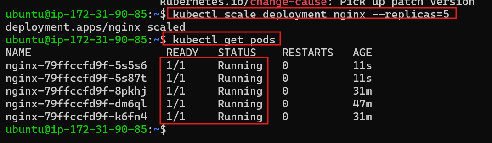

  ### 🔹 Task 5: View rollout history:

  ```bash
kubectl rollout history deployment nginx
```
This command shows the revision history of the deployment, including past changes like image updates or scaling events.

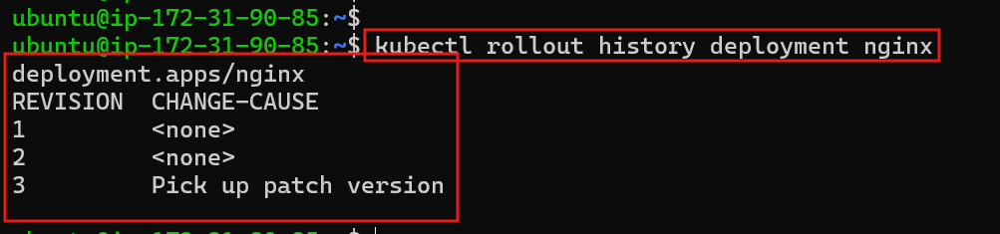

### 🔹 Task 6: Roll back to revision 1:

```bash
kubectl rollout undo deployment nginx --to-revision=1
```
✅ Confirm rollback:

```bash
kubectl describe deployment nginx | grep Image
kubectl get pods
```
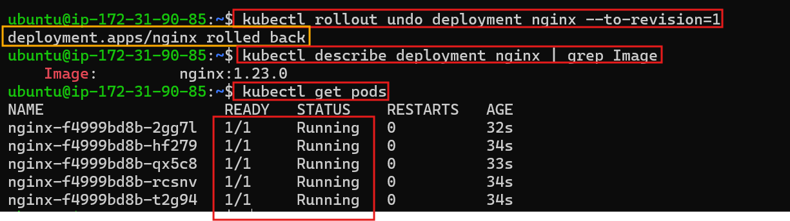


## 🛠️ **PART 3: YAML Troubleshooting**

### ❌ Broken Deployment YAML 1

```yaml
apiVersion: v1        
kind: Deployment
metadata:
  name: nginx-deploy
  labels:
    env: demo
spec:
  replicas: 3
  selector:
    matchLabels:
      env: demo
  template:
    metadata:
      name: nginx        
      labels:
        env: demo
    spec:
      containers:
      - image: nginx
        name: nginx
        ports:
        - containerPort: 80
```
❌ Errors in the YAML:
`apiVersion: v1`

❌ Wrong: `apiVersion: v1`

✅ Fix: 

Should be `apps/v1` for Deployments.

`metadata.name` inside pod template

❌ Wrong: `name: nginx` under `template.metadata`

✅ Fix:

 Remove it. Pods don't require a `name` field inside the template's metadata.


✅ Fixed YAML:

```yaml
apiVersion: apps/v1
kind: Deployment
metadata:
  name: nginx-deploy
  labels:
    env: demo
spec:
  replicas: 3
  selector:
    matchLabels:
      env: demo
  template:
    metadata:
      labels:
        env: demo
    spec:
      containers:
      - image: nginx
        name: nginx
        ports:
        - containerPort: 80
```
### ❌ Broken Deployment YAML 2 (Selector mismatch)

```yaml
selector:
  matchLabels:
    env: dev      ❌ Mismatch with template labels (demo)
```

✅ Fix the selector to match labels:

```yaml
selector:
  matchLabels:
    env: demo
```
Then apply again:

```bash
kubectl apply -f fixed-deploy.yaml
kubectl get deployments
```
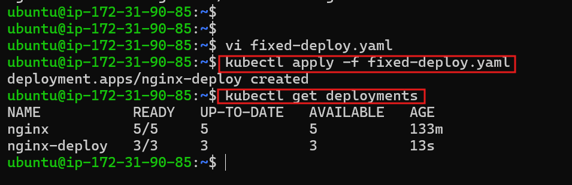


## 🧠 **PART 4: Document & Share Learnings**

**✅ 1. Role of ReplicaSets vs Deployments**

ReplicaSet ensures that a specific number of pod replicas are running at any given time.

Deployment is a higher-level abstraction that manages ReplicaSets and enables rolling updates, rollbacks, and declarative updates.

💡 You almost never create ReplicaSets directly — use Deployments, and they handle ReplicaSets behind the scenes.

**✅ 2. How to Perform Rolling Updates and Rollbacks**

🔄 Rolling Update:
```bash

kubectl set image deployment/nginx nginx=nginx:1.25.0
kubectl rollout status deployment/nginx
```
⏪ Rollback:
```bash
kubectl rollout undo deployment/nginx
```
**✅ 3. Common YAML Mistakes and Troubleshooting**

✅ 4. Use of `kubectl rollout`, `set image`, scale, annotate

Command

`kubectl rollout status deployment/<name>`
purpose	  
```bash
Monitor rollout progress
```
command

`kubectl set image deployment/<name> <container>=<new-image>`
	
  purpose
  ```
  Trigger rolling update
  ```
command

`kubectl rollout undo deployment/<name>`
purpose
```
	Roll back to previous revision
``` 
command

`kubectl scale deployment/<name>
 --replicas=N`	
 
 purpose

 Change number of pods
kubectl annotate deployment/<name> kubernetes.io/change-cause="Reason"


