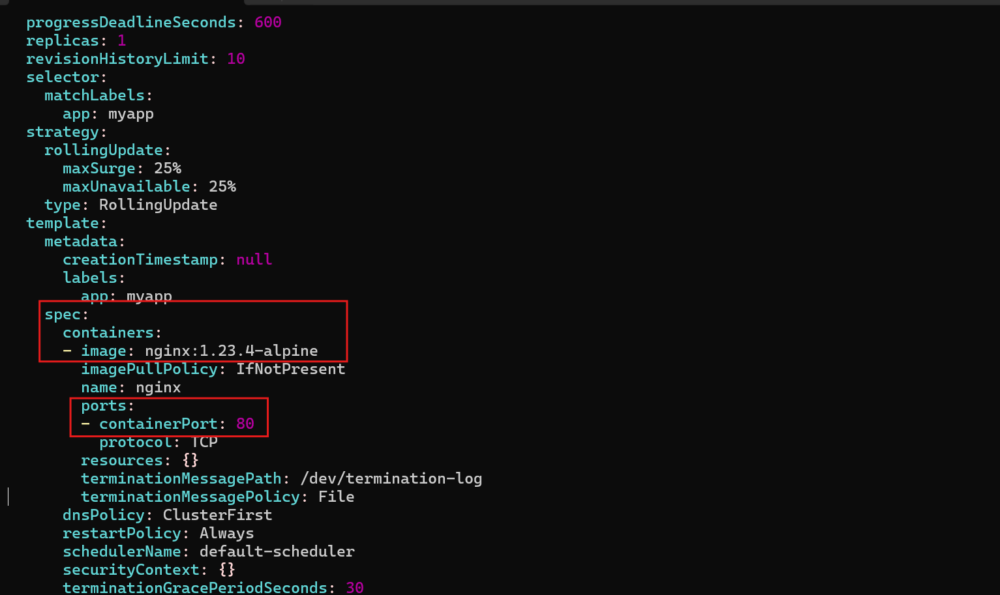
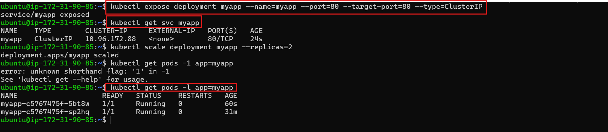
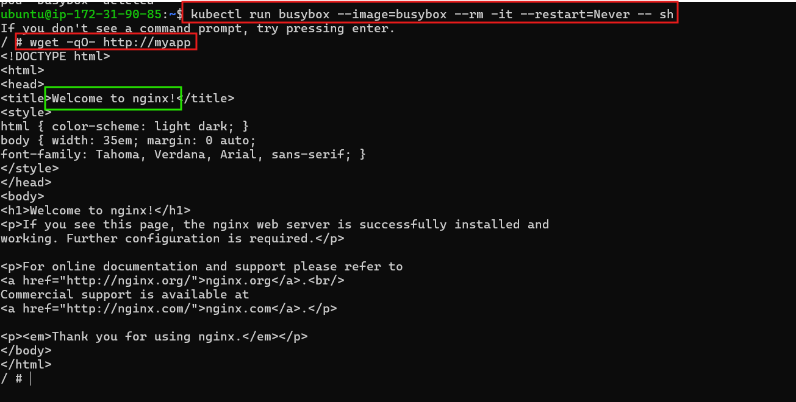
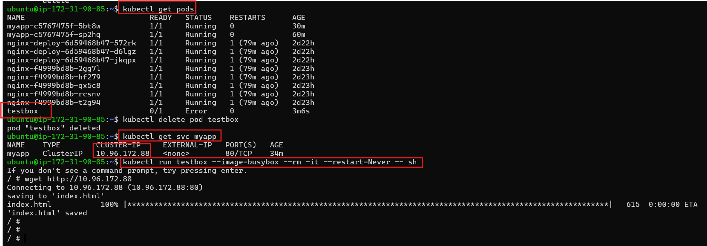
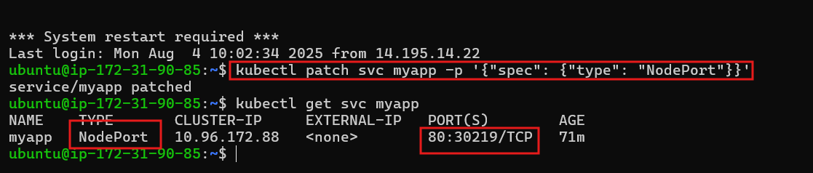

## 🌐 **Kubernetes Service Types: ClusterIP vs NodePort**

### 🎯 **Objective:**

Learn how Kubernetes Services expose Pods internally and externally. Compare `ClusterIP` vs `NodePort`, and validate reachability from within and outside the cluster.

---

Expose a deployment using two types of services and test accessibility:

🧩 ClusterIP: Internal communication

🌍 NodePort: External communication

## ✅ **Task Steps**

### 🔧 Step 1: Create Deployment `myapp`
✅ Expose container port 80:

```bash
kubectl edit deployment myapp
```

Update the `containers` section:

```yaml
containers:
- name: nginx
  image: nginx:1.23.4-alpine
  ports:
  - containerPort: 80
```

Apply changes and confirm:

```bash
kubectl get deployments
kubectl describe deployment myapp
```




### 🛠️ Step 2: Create Service of type `ClusterIP`

```bash
kubectl expose deployment myapp --name=myapp --port=80 --target-port=80 --type=ClusterIP
```

✅ Confirm service:

```bash
kubectl get svc myapp
```


### 📈 Step 3: Scale Deployment to 2 replicas

```bash
kubectl scale deployment myapp --replicas=2
kubectl get pods -l app=myapp
```


### 🧪 Step 4: Access Service Internally (via BusyBox)

```bash
kubectl run busybox --image=busybox --rm -it --restart=Never -- sh
```
✅ You should see the HTML from NGINX.



### 🌍 Step 5: Test External Access (Fails)

From your host system:

```bash
wget http://<ClusterIP>
```

❌ This **will fail** because `ClusterIP` is internal-only.


### 🔁 Step 6: Change Service Type to `NodePort`

```bash
kubectl patch svc myapp -p '{"spec": {"type": "NodePort"}}'
kubectl get svc myapp
```

🔍 Note the new `NodePort` (e.g., 31500)


### 🌐 Step 7: Access Service from Outside

From your host (if using KIND or Minikube, use the node’s IP):

```bash
wget http://<NodeIP>:<NodePort>
```

✅ You should get a response from NGINX.


